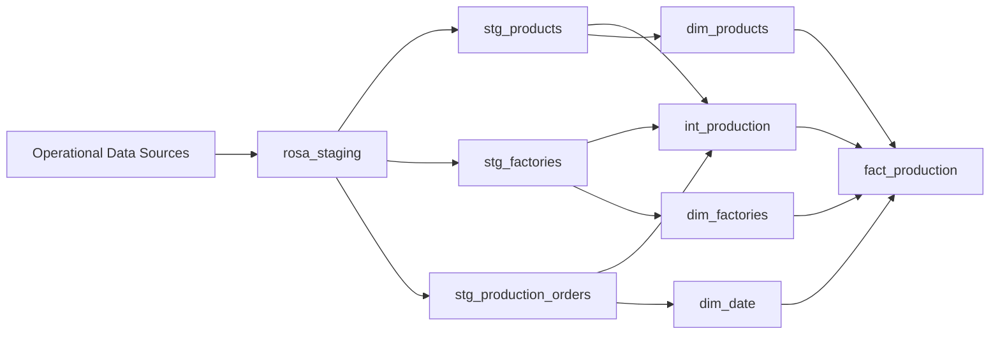
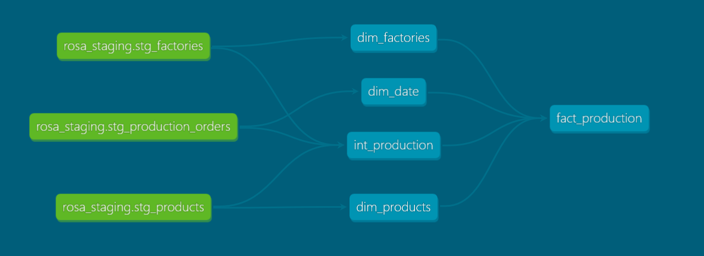
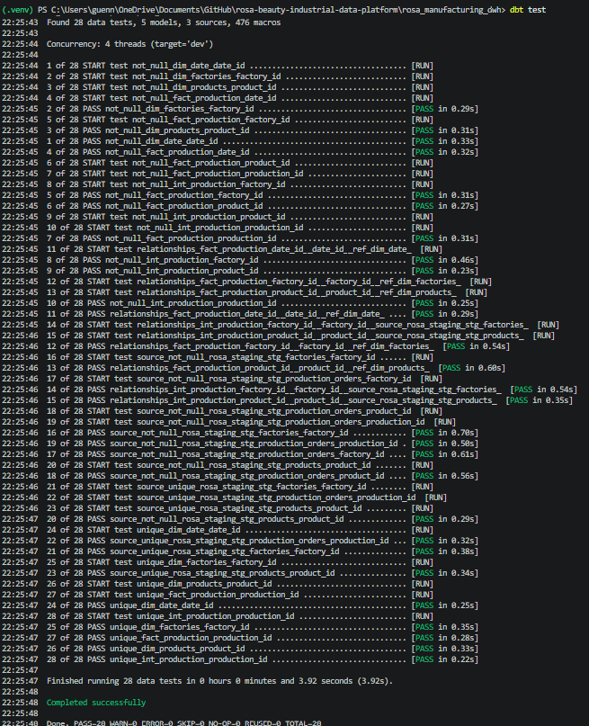
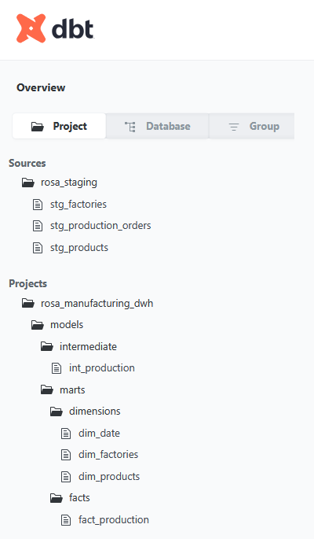

# Rosa Manufacturing Data Platform


---

## Overview

**Rosa Manufacturing Data Platform** is an end-to-end data engineering project designed to build an analytical data warehouse for a manufacturing company.

The objective of this project is to transform raw operational production data into a reliable, structured, and analytics-ready data platform using modern data engineering practices.

This project implements an ELT approach using **PostgreSQL** as the data storage layer and dbt as the transformation framework, including:

- Data source definition and modeling
- Data transformation and enrichment
- Dimensional data modeling
- Data quality testing
- Documentation and lineage generation
- Analytics-ready datasets for business intelligence

The final data warehouse provides a reliable foundation for production performance analysis and reporting.

---

## Business Context

Rosa Manufacturing is a manufacturing company producing cosmetic products across multiple production facilities.

The company collects operational data related to:

- Manufactured products
- Production facilities
- Production orders

However, raw operational data is not directly optimized for analytical use.

The objective of this project is to design and implement a modern data warehouse that enables business teams to monitor production performance and make data-driven decisions.

### Business Questions Addressed

#### Production Performance

- How does actual production compare with planned production?
- Which factories have the highest production efficiency?
- How does production evolve over time?

#### Product Analysis

- Which products contribute the most to production volume?
- How does production vary by product category and brand?

#### Quality Monitoring

- What is the production defect rate?
- Which production orders require attention?

#### Operational Monitoring

- Track production efficiency indicators
- Compare factory performance
- Analyze historical production trends

---

## Architecture Overview

The project follows a modern **ELT (Extract, Load, Transform)** architecture.

Operational production data is loaded into PostgreSQL staging tables, transformed using dbt, and organized into an analytical data warehouse following a **star schema model**.

The architecture is structured into four main layers:

1. **Source Layer**
   - Operational production source tables
   - Stored in PostgreSQL staging schema

2. **Transformation Layer**
   - Data cleaning and enrichment using dbt
   - Business logic implementation
   - Intermediate transformations

3. **Data Warehouse Layer**
   - Analytical model based on dimensions and fact tables
   - Optimized for reporting and business analysis

4. **Analytics Layer**
   - Consumption of curated datasets through BI tools

---

## Data Pipeline Architecture




## Technology Stack

The project is built using modern data engineering and analytics engineering technologies.

| Category | Technology |
|---|---|
| Database | PostgreSQL |
| Transformation Framework | dbt Core |
| Query Language | SQL |
| Data Modeling | Star Schema |
| Data Quality | dbt Generic Tests |
| Documentation | dbt Docs |
| Version Control | Git & GitHub |

---

## Project Structure

The project follows a modular dbt structure to ensure scalability, maintainability, and clear separation of responsibilities.

```text
rosa_manufacturing_dwh/

├── models/
│
├── staging/
│   └── sources.yml
│
├── intermediate/
│   ├── int_production.sql
│   └── schema.yml
│
└── marts/
    │
    ├── dimensions/
    │   ├── dim_products.sql
    │   ├── dim_factories.sql
    │   ├── dim_date.sql
    │   └── schema.yml
    │
    └── facts/
        ├── fact_production.sql
        └── schema.yml

├── dbt_project.yml
│
├── packages.yml
│
└──  README.md

```

## dbt Layer Organization

### Staging Layer

The staging layer represents the connection with raw operational data sources.

Responsibilities:

- Define source tables
- Document source datasets
- Provide a clean entry point for transformations

Source tables:

- `stg_products`
- `stg_factories`
- `stg_production_orders`

---

### Intermediate Layer

The intermediate layer contains business transformations before loading the final warehouse model.

Main model:

`int_production`

Responsibilities:

- Combine production orders with product information
- Combine production data with factory information
- Calculate production KPIs
- Apply business rules

---

### Marts Layer

The marts layer contains business-ready analytical datasets.

It is divided into:

#### Dimensions

Contains descriptive entities:

- `dim_products`
- `dim_factories`
- `dim_date`

#### Facts

Contains measurable business events:

- `fact_production`

This layer is designed for analytics and reporting consumption.

# Data Warehouse Modeling

## Dimension Tables

### dim_products

#### Purpose

The `dim_products` table stores descriptive information about manufactured products.

It provides product attributes used for production analysis.

#### Main Attributes

| Column | Description |
|---|---|
| product_id | Unique identifier of the product |
| product_name | Name of the manufactured product |
| category | Product category |
| brand | Product brand |
| volume_ml | Product volume |
| launch_date | Product launch date |

#### Usage Examples

Business teams can analyze:

- Production volume by product
- Performance by category
- Production trends by brand

### dim_factories

#### Purpose

The `dim_factories` table contains descriptive information about manufacturing facilities.

It enables production analysis by factory location.

#### Main Attributes

| Column | Description |
|---|---|
| factory_id | Unique identifier of the factory |
| factory_name | Factory name |
| city | Factory location |
| region | Administrative region |
| country | Country where the factory operates |

#### Usage Examples

Business teams can analyze:

- Factory performance comparison
- Production efficiency by location
- Operational capacity analysis


---

### dim_date

#### Purpose

The `dim_date` table provides a dedicated calendar dimension for time-based analysis.

Separating date attributes into a dimension simplifies reporting and enables consistent time intelligence.

#### Main Attributes

| Column | Description |
|---|---|
| date_id | Surrogate key used for joins |
| production_date | Original production timestamp |
| year | Production year |
| month | Production month |
| day | Production day |

#### Usage Examples

Business teams can analyze:

- Monthly production trends
- Yearly production evolution
- Seasonal variations


---

## Fact Table

### fact_production

#### Purpose

The `fact_production` table is the central table of the warehouse.

It contains production events and operational performance indicators.

The table connects all dimensions through foreign keys:

```text
fact_production

        |
        |-- product_id  → dim_products
        |
        |-- factory_id  → dim_factories
        |
        |-- date_id     → dim_date
```
The fact table enables cross-analysis between products, factories, and production periods.

---

#### Main Attributes

| Column | Description |
|---|---|
| production_id | Unique identifier of the production event |
| product_id | Foreign key referencing the product dimension |
| factory_id | Foreign key referencing the factory dimension |
| date_id | Foreign key referencing the date dimension |
| planned_quantity | Planned production quantity |
| actual_quantity | Actual produced quantity |
| production_variance | Difference between actual and planned production |
| production_efficiency | Ratio between actual and planned production |
| defect_rate | Percentage of defective production |
| production_status | Current production order status |

---

#### Data Quality Rules

The fact table implements data quality controls using **dbt tests**.

Applied tests include:

| Column | Test | Purpose |
|---|---|---|
| production_id | unique | Ensures each production event is unique |
| production_id | not_null | Ensures every production event has an identifier |
| product_id | not_null | Ensures every production record is linked to a product |
| factory_id | not_null | Ensures every production record is linked to a factory |
| date_id | not_null | Ensures every production record has a valid date |
| product_id | relationships | Validates product dimension integrity |
| factory_id | relationships | Validates factory dimension integrity |
| date_id | relationships | Validates date dimension integrity |

---

## Business KPIs Generated

The warehouse enables calculation and monitoring of key manufacturing performance indicators.

---

### Production Variance

Formula:

```text
Production Variance = Actual Quantity - Planned Quantity
```
This KPI measures the difference between expected production and achieved production.

#### Interpretation

- Positive value → Production exceeded the target
- Negative value → Production did not reach the target


---

### Production Efficiency

#### Formula

```text
Production Efficiency = Actual Quantity / Planned Quantity
```

This KPI measures production performance compared with the initial production plan.

#### Interpretation

- Efficiency > 1 → Production exceeded expectations
- Efficiency = 1 → Production matched the plan
- Efficiency < 1 → Production underperformed


---

## Quality Monitoring

The warehouse also supports quality analysis through defect rate monitoring.

Production quality is classified using the following business rules:

```text
Defect Rate < 2%       → Good

Defect Rate 2% - 5%    → Acceptable

Defect Rate > 5%       → Needs Review
```
This classification helps identify production issues and prioritize operational improvements.

The `fact_production` table provides a reliable analytical foundation for:

- Production monitoring
- Factory performance analysis
- Quality management
- Business intelligence reporting

## Data Transformation Logic

The transformation layer is implemented using **dbt Core** and follows an ELT approach.

The objective of this layer is to transform raw operational data into structured, validated, and analytics-ready datasets.

The transformation process includes:

- Source data extraction from PostgreSQL staging tables
- Data enrichment through business joins
- Intermediate transformations
- Dimension creation
- Fact table generation
- Business KPI calculations

### Source Data Preparation

The staging layer provides a clean and documented entry point to the raw operational data.

The source tables are stored in the PostgreSQL staging schema:

| Source Table | Description |
|---|---|
| stg_products | Contains product information such as product name, category, brand, and volume |
| stg_factories | Contains manufacturing facility information including location and operational attributes |
| stg_production_orders | Contains production events, quantities, dates, and quality indicators |

The staging layer is managed through dbt source definitions to ensure:

- Clear data lineage
- Source documentation
- Reliable references for downstream transformations

### Intermediate Transformation Layer

The intermediate layer contains business transformations before creating the final warehouse model.

The main intermediate model is:

`int_production`

This model combines production events with descriptive information from products and factories.

Main transformations:

- Join production orders with product information
- Join production orders with factory information
- Enrich production events with business attributes
- Prepare data for analytical consumption

### Data Enrichment & Business Logic

Business rules are implemented inside dbt transformations to create meaningful analytical indicators.

The intermediate model calculates:

#### Production Variance

Measures the difference between planned and actual production.

Formula:

```text
Production Variance = Actual Quantity - Planned Quantity
```

#### Production Efficiency

Measures production performance compared with the initial target.

Formula:

```text
Production Efficiency = Actual Quantity / Planned Quantity
```

#### Quality Classification

Production quality is classified based on defect rate:

```text

Defect Rate < 2%       → Good

Defect Rate 2%-5%      → Acceptable

Defect Rate > 5%       → Needs Review
```
These transformations convert raw production data into business-ready metrics.

### Dimension Model Creation

The marts layer contains analytical dimensions following a star schema approach.

Three dimension tables are created:

| Dimension | Purpose |
|---|---|
| dim_products | Stores descriptive information about manufactured products |
| dim_factories | Stores descriptive information about production facilities |
| dim_date | Provides calendar attributes for time-based analysis |

These dimensions improve analytical performance by separating descriptive attributes from measurable events.

### Dimension Model Creation

The marts layer contains analytical dimensions following a star schema approach.

Three dimension tables are created:

| Dimension | Purpose |
|---|---|
| dim_products | Stores descriptive information about manufactured products |
| dim_factories | Stores descriptive information about production facilities |
| dim_date | Provides calendar attributes for time-based analysis |

These dimensions improve analytical performance by separating descriptive attributes from measurable events.

### Fact Table Generation

The final fact model is created in:

`fact_production`

This table centralizes production events and connects all analytical dimensions.

The fact table is built from:

- `int_production`
- `dim_products`
- `dim_factories`
- `dim_date`

It contains:

- Production quantities
- Production performance indicators
- Quality metrics
- Foreign keys linking analytical dimensions

The resulting model provides a reliable foundation for reporting and business intelligence analysis.

### Testing Strategy

The project follows a testing strategy based on dbt generic tests.

Tests are applied at different layers:

| Layer | Purpose |
|---|---|
| Source Layer | Validate source data availability and structure |
| Intermediate Layer | Ensure transformation logic consistency |
| Mart Layer | Guarantee analytical model reliability |

This approach helps maintain trustworthy datasets from ingestion to business consumption.

### Implemented dbt Tests

The project implements the following dbt generic tests:

| Test | Description | Purpose |
|---|---|---|
| unique | Checks that values are unique | Ensures primary key uniqueness |
| not_null | Checks missing values | Ensures mandatory fields are populated |
| relationships | Validates foreign key relationships | Ensures referential integrity between tables |

These tests are defined in YAML schema files and executed automatically using dbt.

### Primary Key Validation

Primary keys are validated using `unique` and `not_null` tests.

Examples:

| Table | Column | Tests |
|---|---|---|
| dim_products | product_id | unique, not_null |
| dim_factories | factory_id | unique, not_null |
| dim_date | date_id | unique, not_null |
| fact_production | production_id | unique, not_null |

These validations ensure that each analytical entity has a reliable identifier.

### Referential Integrity Validation

Foreign key relationships are tested to guarantee consistency between fact and dimension tables.

The following relationships are validated:

| Fact Table Column | Referenced Dimension |
|---|---|
| fact_production.product_id | dim_products.product_id |
| fact_production.factory_id | dim_factories.factory_id |
| fact_production.date_id | dim_date.date_id |

These tests prevent orphan records and ensure that all production events are correctly linked to their descriptive dimensions.

### Test Execution

Data quality tests are executed using the dbt command:

```bash
dbt test
```
The execution validates all defined quality rules across the project models.

Example test results:
Completed successfully

```bash
PASS=29
WARN=0
ERROR=0
```

---


### Data Quality Benefits

The implemented testing framework provides:

- Reliable analytical datasets
- Early detection of data issues
- Improved confidence in business reporting
- Maintainable and scalable data pipelines

By integrating data quality checks directly into dbt transformations, the platform ensures that business users consume consistent and trustworthy information.

## dbt Documentation & Lineage

The project uses **dbt documentation features** to provide visibility into the data warehouse structure, transformation logic, and model dependencies.

dbt automatically generates technical documentation from:

- Model definitions
- Source configurations
- Column descriptions
- Data tests
- Model dependencies

This documentation improves project maintainability and facilitates collaboration between data engineers, analysts, and business teams.

### Documentation Management

All models and sources are documented using dbt YAML files.

Documentation includes:

- Model descriptions
- Column definitions
- Data quality rules
- Source information
- Relationships between datasets

Example documented layers:

| Layer | Documented Objects |
|---|---|
| Source Layer | stg_products, stg_factories, stg_production_orders |
| Intermediate Layer | int_production |
| Mart Layer | dim_products, dim_factories, dim_date, fact_production |

This documentation provides a clear understanding of the role and purpose of each dataset.

### Data Lineage

dbt automatically generates a lineage graph representing the relationships between models.

The lineage allows users to understand:

- Where data comes from
- How data is transformed
- Which models depend on each other
- How changes propagate through the pipeline

The main data flow is:

```text
PostgreSQL Sources

        ↓

Staging Layer

        ↓

Intermediate Transformation

        ↓

Dimensions & Fact Tables

        ↓

Business Intelligence Layer

```

### Model Dependency Graph

The final warehouse follows the following dependency structure:

```text
stg_products
        |
        ├──────────────→ dim_products
        |
        └──────────────→ int_production


stg_factories
        |
        ├──────────────→ dim_factories
        |
        └──────────────→ int_production


stg_production_orders
        |
        ├──────────────→ dim_date
        |
        └──────────────→ int_production


int_production
        |
        └──────────────→ fact_production


dim_products
dim_factories
dim_date
        |
        └──────────────→ fact_production
```
### Generating dbt Documentation

The documentation is generated using dbt commands.

Generate documentation:

```bash
dbt docs generate
```

Launch the documentation website:
```bash
dbt docs serve
```

### Documentation Benefits

The dbt documentation layer provides several benefits:

- Improves understanding of the data platform
- Simplifies onboarding of new team members
- Facilitates debugging and maintenance
- Ensures transparency of transformations
- Supports collaboration between technical and business teams

A well-documented data platform improves reliability and long-term scalability.

# Data Quality Framework

Data quality is a critical component of this project to ensure that analytical datasets are reliable, consistent, and ready for business consumption.

The project implements automated data quality checks using **dbt tests**.

These tests are executed during the transformation workflow and validate the integrity of the data warehouse models.

---

## Implemented Data Quality Checks

### Uniqueness Validation

Ensures that primary business identifiers are unique.

Applied on:

- `product_id` in `dim_products`
- `factory_id` in `dim_factories`
- `date_id` in `dim_date`
- `production_id` in `fact_production`

Example:

```yaml
tests:
  - unique
```

Purpose:

- Prevent duplicate dimension records
- Guarantee reliable joins between tables

---

## Null Value Validation

Ensures that mandatory fields are always populated.

Applied on key columns:

| Table | Column |
|---|---|
| dim_products | product_id |
| dim_factories | factory_id |
| dim_date | date_id |
| fact_production | production_id |
| fact_production | product_id |
| fact_production | factory_id |
| fact_production | date_id |

Example:

```yaml
tests:
  - not_null
```

Purpose:

- Avoid incomplete analytical records
- Maintain referential integrity

---

## Referential Integrity Validation

Relationships between fact and dimension tables are validated using dbt relationship tests.

The warehouse follows a star schema where:

```
fact_production
        |
        |---- product_id → dim_products
        |
        |---- factory_id → dim_factories
        |
        |---- date_id → dim_date
```

Example:

```yaml
tests:
  - relationships:
      to: ref('dim_products')
      field: product_id
```

Purpose:

- Ensure all foreign keys match existing dimension records
- Prevent orphan records
- Guarantee consistency across analytical models

---

## Data Quality Workflow

The validation process follows this workflow:

```
Data Sources

      ↓

Staging Layer

      ↓

dbt Transformations

      ↓

Data Quality Tests

      ↓

Analytics Ready Warehouse
```

Before deployment or analysis, dbt tests validate the reliability of generated datasets.

---

## Benefits

The implemented quality framework provides:

- Reliable analytical datasets
- Early detection of data issues
- Automated validation during development
- Improved trust in business reporting
- Maintainable and scalable data pipelines

# dbt Documentation & Data Lineage

The project uses **dbt documentation capabilities** to provide visibility into the data warehouse structure, model dependencies, and data transformations.

dbt automatically generates technical documentation from:

- SQL models
- Source definitions
- Model descriptions
- Column descriptions
- Data tests
- Model dependencies

This documentation provides a centralized view of the analytical data platform.

---

## Generated Documentation

The dbt documentation includes:

- Data warehouse models overview
- Source-to-model relationships
- Column-level descriptions
- Applied data quality tests
- Model dependencies and lineage graph

The documentation allows both technical and business users to understand how data flows through the platform.

---

## Data Lineage Overview

The data lineage describes the complete journey of data from operational sources to analytical tables.

The implemented lineage is:

```
Operational Data Sources

        ↓

rosa_staging

        ↓

Staging Sources
- stg_products
- stg_factories
- stg_production_orders

        ↓

Intermediate Layer

- int_production

        ↓

Warehouse Marts

Dimensions:
- dim_products
- dim_factories
- dim_date

Fact:
- fact_production

        ↓

Business Analytics
```

---

The lineage helps identify:

- Data origins
- Transformation steps
- Dependencies between models
- Impact of future changes

## Documentation Benefits

Using dbt documentation provides several advantages:

### Data Transparency

Teams can understand where data comes from and how metrics are calculated.

### Maintainability

Developers can quickly identify dependencies and evaluate the impact of modifications.

### Collaboration

Documentation creates a common understanding between:

- Data engineers
- Data analysts
- Business stakeholders

### Data Governance

The documented lineage improves traceability and supports better data governance practices.

---

The dbt documentation layer transforms the warehouse from a collection of SQL models into a documented and maintainable data platform.

# Project Setup & Execution

This section explains how to install, configure, and execute the Rosa Manufacturing Data Platform locally.

The project runs using:

- PostgreSQL as the data warehouse database
- dbt Core as the transformation framework
- Git for version control

---

## Prerequisites

Before running the project, make sure the following tools are installed:

| Tool | Purpose |
|---|---|
| PostgreSQL | Database management system |
| Python | Runtime environment |
| dbt Core | Data transformation framework |
| Git | Version control |

Required knowledge:

- SQL
- PostgreSQL
- dbt fundamentals
- Command line usage

---

## Clone the Repository

Clone the project repository:

```bash
git clone <repository_url>
```

Navigate to the project directory:

```bash
cd rosa_manufacturing_dwh
```

## Create Python Environment

Create and activate a virtual environment:

```bash
python -m venv .venv
```

Activate the environment:

### Windows

```bash
.venv\Scripts\activate
```

### Linux / MacOS

```bash
source .venv/bin/activate
```

---

## Install dbt Dependencies

Install dbt with PostgreSQL adapter:

```bash
pip install dbt-postgres
```

Verify installation:

```bash
dbt --version
```

Expected output:

```
dbt=1.x.x
adapter=postgres
```

## PostgreSQL Configuration

Create the PostgreSQL database:

```sql
CREATE DATABASE rosa_manufacturing;
```

The project uses the following database structure:

```
rosa_manufacturing

├── staging
│   ├── stg_products
│   ├── stg_factories
│   └── stg_production_orders
│
├── warehouse_intermediate
│   └── int_production
│
└── warehouse
    ├── dim_products
    ├── dim_factories
    ├── dim_date
    └── fact_production
```

---

## Configure dbt Connection

Update the `profiles.yml` file with PostgreSQL credentials:

Example:

```yaml
rosa_manufacturing_dwh:

  target: dev

  outputs:

    dev:
      type: postgres
      host: localhost
      user: postgres
      password: <password>
      port: 5432
      database: rosa_manufacturing
      schema: warehouse
      threads: 4
```

Test the connection:

```bash
dbt debug
```

A successful connection should display:

```
Connection test: OK
```

## Running the Data Pipeline

The data transformation workflow is managed through dbt commands.

The execution process follows these main steps:

```
Source Data
     |
     ↓
dbt Models Execution
     |
     ↓
Data Quality Validation
     |
     ↓
Documentation Generation
```

---

## Install dbt Packages

Before running the project, install required dbt dependencies:

```bash
dbt deps
```

This command installs external dbt packages defined in:

```
packages.yml
```

---

## Parse the Project

Validate the dbt project structure:

```bash
dbt parse
```

This step checks:

- SQL syntax
- Model references
- Source definitions
- Configuration consistency

A successful parse confirms that dbt can correctly understand the project structure.

---

## Build the Data Warehouse

Execute all transformation models:

```bash
dbt run
```

The execution order is automatically managed by dbt based on model dependencies.

The build sequence is:

```
Sources

   ↓

Intermediate Models

int_production

   ↓

Dimension Tables

dim_products
dim_factories
dim_date

   ↓

Fact Table

fact_production
```

---

## Run Data Quality Tests

Execute all defined data quality checks:

```bash
dbt test
```

The tests validate:

- Primary key uniqueness
- Mandatory fields completeness
- Referential integrity between fact and dimension tables

Example validation:

```
fact_production.product_id
        |
        ↓
dim_products.product_id
```

---

## Generate dbt Documentation

Create the project documentation:

```bash
dbt docs generate
```

This command generates:

- Model documentation
- Column descriptions
- Data lineage information
- Test documentation

---

## Access dbt Documentation Interface

Launch the documentation server:

```bash
dbt docs serve
```

The interface provides:

- Interactive model exploration
- Lineage visualization
- Source-to-target tracking
- Documentation browsing

---

## Complete Execution Workflow

The complete local workflow is:

```bash
dbt deps

dbt debug

dbt parse

dbt run

dbt test

dbt docs generate

dbt docs serve
```

This workflow ensures that the data platform is built, validated, and documented before analytical consumption.

# Project Challenges & Technical Decisions

Building this data platform required several technical decisions to ensure scalability, maintainability, and data reliability.

The main challenges addressed during the project were:

- Structuring raw operational data for analytics
- Designing a scalable data warehouse model
- Ensuring data quality and consistency
- Managing dependencies between transformations
- Creating a maintainable ELT workflow

---

# Data Warehouse Modeling Decision

## Challenge

Raw production data contains operational information about:

- Products
- Factories
- Production orders

However, this structure is not optimized for analytical queries and business reporting.

---

## Solution

A dimensional data warehouse model was implemented using a **Star Schema approach**.

The model separates:

### Dimension Tables

Containing descriptive information:

- `dim_products`
- `dim_factories`
- `dim_date`

### Fact Table

Containing measurable production events:

- `fact_production`

The final structure improves:

- Query performance
- Data readability
- Business analysis capabilities

# ELT Approach with dbt

## Challenge

Traditional ETL pipelines often require complex transformation logic outside the database.

For analytical workloads, SQL-based transformations provide a more flexible and maintainable approach.

---

## Solution

The project follows an ELT architecture:

```
Data Sources

      ↓

Load into Database

      ↓

Transform using dbt

      ↓

Analytics-ready Warehouse
```

dbt was selected as the transformation framework because it provides:

- SQL-based transformations
- Dependency management
- Automated testing
- Documentation generation
- Data lineage tracking

---

## Benefits

This approach allows:

- Faster development cycles
- Easier maintenance of transformations
- Better collaboration between data engineers and analysts

# Data Quality Strategy

## Challenge

Production data must remain reliable before being used for analysis.

Potential issues include:

- Duplicate records
- Missing identifiers
- Invalid relationships between tables

---

## Solution

Automated data quality controls were implemented using dbt tests.

The validation strategy includes:

### Uniqueness Tests

Ensures business keys are unique.

Example:

```
production_id
product_id
factory_id
date_id
```

---

### Completeness Tests

Ensures mandatory fields are populated.

Example:

```
not_null(product_id)
not_null(factory_id)
```

---

### Referential Integrity Tests

Ensures relationships between fact and dimension tables remain valid.

Example:

```
fact_production.product_id

        ↓

dim_products.product_id
```

---

## Benefits

The implemented quality framework improves:

- Data reliability
- Error detection
- Trust in analytical results
- Maintainability of the platform

# Database Technology Choice

## Why PostgreSQL?

PostgreSQL was selected as the database engine for this project because it provides:

- Strong SQL capabilities
- Reliability and stability
- Support for analytical workloads
- Open-source ecosystem
- Compatibility with modern data engineering tools

It provides a realistic environment for developing and testing a data warehouse solution.

---

## Why dbt + PostgreSQL?

The combination of PostgreSQL and dbt provides:

- Database-driven transformations
- Version-controlled SQL models
- Automated testing
- Reproducible data pipelines

This combination reflects modern analytics engineering practices used in production environments.

# Database Technology Choice

## Why PostgreSQL?

PostgreSQL was selected as the database engine for this project because it provides:

- Strong SQL capabilities
- Reliability and stability
- Support for analytical workloads
- Open-source ecosystem
- Compatibility with modern data engineering tools

It provides a realistic environment for developing and testing a data warehouse solution.

---

## Why dbt + PostgreSQL?

The combination of PostgreSQL and dbt provides:

- Database-driven transformations
- Version-controlled SQL models
- Automated testing
- Reproducible data pipelines

This combination reflects modern analytics engineering practices used in production environments.

# Future Improvements

Although the current platform provides a complete analytical data warehouse solution, several improvements could be implemented to move the project closer to an enterprise-grade data platform.

---

## Cloud Migration

The current solution runs locally using PostgreSQL.

A future evolution would be to migrate the platform to a cloud architecture using services such as:

- Azure Data Lake Storage Gen2 for scalable data storage
- Azure Data Factory for data ingestion and orchestration
- Azure SQL Database or Azure Synapse Analytics for cloud-based analytics

Target architecture:

```
Data Sources

      ↓

Cloud Data Lake

      ↓

Data Pipeline Orchestration

      ↓

Cloud Data Warehouse

      ↓

BI Analytics
```

Benefits:

- Scalability
- High availability
- Cloud-native data processing
- Enterprise data management capabilities

---

## Data Pipeline Orchestration

The current workflow relies on manual dbt execution.

A future improvement would be to introduce workflow orchestration tools such as:

- Apache Airflow
- Azure Data Factory

to automate:

- Data ingestion
- Transformation scheduling
- Pipeline monitoring
- Failure handling

---

## Incremental Data Processing

Currently, models process the available dataset during execution.

For larger production environments, incremental models could be implemented to process only new or modified records.

Benefits:

- Reduced processing time
- Lower computational cost
- Better scalability for growing datasets

Example:

```
New Production Records

        ↓

Incremental dbt Model

        ↓

Updated Warehouse Tables
```

---

## Advanced Data Quality Monitoring

The current solution includes dbt tests for:

- Uniqueness
- Completeness
- Referential integrity

Future improvements could include:

- Data freshness monitoring
- Anomaly detection
- Automated data quality reporting
- Data observability tools

---

## Business Intelligence Layer

The current warehouse is designed to support analytical consumption.

A future implementation could include a BI layer using tools such as:

- Power BI
- Tableau

Potential dashboards:

### Production Performance Dashboard

Metrics:

- Production efficiency
- Planned vs actual production
- Factory performance

### Quality Dashboard

Metrics:

- Defect rate evolution
- Quality classification
- Production issues tracking

---

## Advanced Analytics

Additional analytical capabilities could be added:

- Production forecasting
- Demand prediction
- Anomaly detection
- Machine learning models for optimization

Python-based machine learning workflows could consume the curated warehouse datasets.

---

These improvements would transform the current analytical warehouse into a complete enterprise data platform combining data engineering, cloud infrastructure, business intelligence, and advanced analytics.

# Project Demonstration

This section presents key screenshots from the implemented data platform.

---

## dbt Documentation & Lineage

The dbt documentation interface provides visibility into:

- Data models
- Source definitions
- Model dependencies
- Data lineage


---

## Data Quality Validation

Automated data quality checks are implemented using dbt tests.

Validated controls include:

- Primary key uniqueness
- Mandatory fields completeness
- Referential integrity between fact and dimension tables



---

## dbt Warehouse Structure & Lineage

The dbt documentation interface provides a complete view of the implemented data warehouse structure.

It highlights:

- Source tables
- Transformation dependencies
- Intermediate models
- Dimension tables
- Fact tables

The lineage graph represents the complete data flow from operational sources to analytical models.

