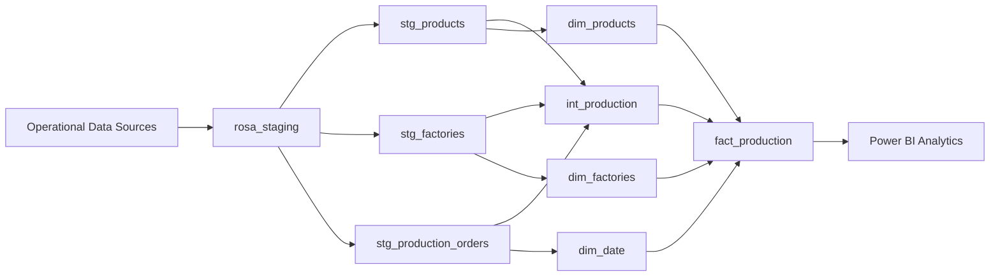

# Rosa Manufacturing Data Platform


---

## Overview

**Rosa Manufacturing Data Platform** is an end-to-end data engineering project designed to build an analytical data warehouse for a manufacturing company.

The objective of this project is to transform raw operational production data into a reliable, structured, and analytics-ready data platform using modern data engineering practices.

This project implements an ELT approach using **PostgreSQL** as the data storage layer and dbt as the transformation framework, including:

- Data source definition and modeling
- Data transformation and enrichment
- Dimensional data modeling
- Data quality testing
- Documentation and lineage generation
- Analytics-ready datasets for business intelligence

The final data warehouse provides a reliable foundation for production performance analysis and reporting.

---

## Business Context

Rosa Manufacturing is a manufacturing company producing cosmetic products across multiple production facilities.

The company collects operational data related to:

- Manufactured products
- Production facilities
- Production orders

However, raw operational data is not directly optimized for analytical use.

The objective of this project is to design and implement a modern data warehouse that enables business teams to monitor production performance and make data-driven decisions.

### Business Questions Addressed

#### Production Performance

- How does actual production compare with planned production?
- Which factories have the highest production efficiency?
- How does production evolve over time?

#### Product Analysis

- Which products contribute the most to production volume?
- How does production vary by product category and brand?

#### Quality Monitoring

- What is the production defect rate?
- Which production orders require attention?

#### Operational Monitoring

- Track production efficiency indicators
- Compare factory performance
- Analyze historical production trends

---

## Architecture Overview

The project follows a modern **ELT (Extract, Load, Transform)** architecture.

Operational production data is loaded into PostgreSQL staging tables, transformed using dbt, and organized into an analytical data warehouse following a **star schema model**.

The architecture is structured into four main layers:

1. **Source Layer**
   - Operational production source tables
   - Stored in PostgreSQL staging schema

2. **Transformation Layer**
   - Data cleaning and enrichment using dbt
   - Business logic implementation
   - Intermediate transformations

3. **Data Warehouse Layer**
   - Analytical model based on dimensions and fact tables
   - Optimized for reporting and business analysis

4. **Analytics Layer**
   - Consumption of curated datasets through BI tools

---

## Data Pipeline Architecture




## Technology Stack

The project is built using modern data engineering and analytics engineering technologies.

| Category | Technology |
|---|---|
| Database | PostgreSQL |
| Transformation Framework | dbt Core |
| Query Language | SQL |
| Data Modeling | Star Schema |
| Data Quality | dbt Generic Tests |
| Documentation | dbt Docs |
| Data Visualization | Power BI |
| Version Control | Git & GitHub |

---

## Project Structure

The project follows a modular dbt structure to ensure scalability, maintainability, and clear separation of responsibilities.

```text
rosa_manufacturing_dwh/

├── models/
│
├── staging/
│   └── sources.yml
│
├── intermediate/
│   ├── int_production.sql
│   └── schema.yml
│
└── marts/
    │
    ├── dimensions/
    │   ├── dim_products.sql
    │   ├── dim_factories.sql
    │   ├── dim_date.sql
    │   └── schema.yml
    │
    └── facts/
        ├── fact_production.sql
        └── schema.yml

├── dbt_project.yml
│
├── packages.yml
│
└──  README.md

```

## dbt Layer Organization

### Staging Layer

The staging layer represents the connection with raw operational data sources.

Responsibilities:

- Define source tables
- Document source datasets
- Provide a clean entry point for transformations

Source tables:

- `stg_products`
- `stg_factories`
- `stg_production_orders`

---

### Intermediate Layer

The intermediate layer contains business transformations before loading the final warehouse model.

Main model:

`int_production`

Responsibilities:

- Combine production orders with product information
- Combine production data with factory information
- Calculate production KPIs
- Apply business rules

---

### Marts Layer

The marts layer contains business-ready analytical datasets.

It is divided into:

#### Dimensions

Contains descriptive entities:

- `dim_products`
- `dim_factories`
- `dim_date`

#### Facts

Contains measurable business events:

- `fact_production`

This layer is designed for analytics and reporting consumption.

# Data Warehouse Modeling

## Dimension Tables

### dim_products

#### Purpose

The `dim_products` table stores descriptive information about manufactured products.

It provides product attributes used for production analysis.

#### Main Attributes

| Column | Description |
|---|---|
| product_id | Unique identifier of the product |
| product_name | Name of the manufactured product |
| category | Product category |
| brand | Product brand |
| volume_ml | Product volume |
| launch_date | Product launch date |

#### Usage Examples

Business teams can analyze:

- Production volume by product
- Performance by category
- Production trends by brand

### dim_factories

#### Purpose

The `dim_factories` table contains descriptive information about manufacturing facilities.

It enables production analysis by factory location.

#### Main Attributes

| Column | Description |
|---|---|
| factory_id | Unique identifier of the factory |
| factory_name | Factory name |
| city | Factory location |
| region | Administrative region |
| country | Country where the factory operates |

#### Usage Examples

Business teams can analyze:

- Factory performance comparison
- Production efficiency by location
- Operational capacity analysis


---

### dim_date

#### Purpose

The `dim_date` table provides a dedicated calendar dimension for time-based analysis.

Separating date attributes into a dimension simplifies reporting and enables consistent time intelligence.

#### Main Attributes

| Column | Description |
|---|---|
| date_id | Surrogate key used for joins |
| production_date | Original production timestamp |
| year | Production year |
| month | Production month |
| day | Production day |

#### Usage Examples

Business teams can analyze:

- Monthly production trends
- Yearly production evolution
- Seasonal variations


---

## Fact Table

### fact_production

#### Purpose

The `fact_production` table is the central table of the warehouse.

It contains production events and operational performance indicators.

The table connects all dimensions through foreign keys:

```text
fact_production

        |
        |-- product_id  → dim_products
        |
        |-- factory_id  → dim_factories
        |
        |-- date_id     → dim_date
```
The fact table enables cross-analysis between products, factories, and production periods.

---

#### Main Attributes

| Column | Description |
|---|---|
| production_id | Unique identifier of the production event |
| product_id | Foreign key referencing the product dimension |
| factory_id | Foreign key referencing the factory dimension |
| date_id | Foreign key referencing the date dimension |
| planned_quantity | Planned production quantity |
| actual_quantity | Actual produced quantity |
| production_variance | Difference between actual and planned production |
| production_efficiency | Ratio between actual and planned production |
| defect_rate | Percentage of defective production |
| production_status | Current production order status |

---

#### Data Quality Rules

The fact table implements data quality controls using **dbt tests**.

Applied tests include:

| Column | Test | Purpose |
|---|---|---|
| production_id | unique | Ensures each production event is unique |
| production_id | not_null | Ensures every production event has an identifier |
| product_id | not_null | Ensures every production record is linked to a product |
| factory_id | not_null | Ensures every production record is linked to a factory |
| date_id | not_null | Ensures every production record has a valid date |
| product_id | relationships | Validates product dimension integrity |
| factory_id | relationships | Validates factory dimension integrity |
| date_id | relationships | Validates date dimension integrity |

---

## Business KPIs Generated

The warehouse enables calculation and monitoring of key manufacturing performance indicators.

---

### Production Variance

Formula:

```text
Production Variance = Actual Quantity - Planned Quantity
```
This KPI measures the difference between expected production and achieved production.

#### Interpretation

- Positive value → Production exceeded the target
- Negative value → Production did not reach the target


---

### Production Efficiency

#### Formula

```text
Production Efficiency = Actual Quantity / Planned Quantity
```

This KPI measures production performance compared with the initial production plan.

#### Interpretation

- Efficiency > 1 → Production exceeded expectations
- Efficiency = 1 → Production matched the plan
- Efficiency < 1 → Production underperformed


---

## Quality Monitoring

The warehouse also supports quality analysis through defect rate monitoring.

Production quality is classified using the following business rules:

```text
Defect Rate < 2%       → Good

Defect Rate 2% - 5%    → Acceptable

Defect Rate > 5%       → Needs Review
```
This classification helps identify production issues and prioritize operational improvements.

The `fact_production` table provides a reliable analytical foundation for:

- Production monitoring
- Factory performance analysis
- Quality management
- Business intelligence reporting

## Data Transformation Logic

The transformation layer is implemented using **dbt Core** and follows an ELT approach.

The objective of this layer is to transform raw operational data into structured, validated, and analytics-ready datasets.

The transformation process includes:

- Source data extraction from PostgreSQL staging tables
- Data enrichment through business joins
- Intermediate transformations
- Dimension creation
- Fact table generation
- Business KPI calculations

### Source Data Preparation

The staging layer provides a clean and documented entry point to the raw operational data.

The source tables are stored in the PostgreSQL staging schema:

| Source Table | Description |
|---|---|
| stg_products | Contains product information such as product name, category, brand, and volume |
| stg_factories | Contains manufacturing facility information including location and operational attributes |
| stg_production_orders | Contains production events, quantities, dates, and quality indicators |

The staging layer is managed through dbt source definitions to ensure:

- Clear data lineage
- Source documentation
- Reliable references for downstream transformations

### Intermediate Transformation Layer

The intermediate layer contains business transformations before creating the final warehouse model.

The main intermediate model is:

`int_production`

This model combines production events with descriptive information from products and factories.

Main transformations:

- Join production orders with product information
- Join production orders with factory information
- Enrich production events with business attributes
- Prepare data for analytical consumption

### Data Enrichment & Business Logic

Business rules are implemented inside dbt transformations to create meaningful analytical indicators.

The intermediate model calculates:

#### Production Variance

Measures the difference between planned and actual production.

Formula:

```text
Production Variance = Actual Quantity - Planned Quantity
```

#### Production Efficiency

Measures production performance compared with the initial target.

Formula:

```text
Production Efficiency = Actual Quantity / Planned Quantity
```

#### Quality Classification

Production quality is classified based on defect rate:

```text

Defect Rate < 2%       → Good

Defect Rate 2%-5%      → Acceptable

Defect Rate > 5%       → Needs Review
```
These transformations convert raw production data into business-ready metrics.

### Dimension Model Creation

The marts layer contains analytical dimensions following a star schema approach.

Three dimension tables are created:

| Dimension | Purpose |
|---|---|
| dim_products | Stores descriptive information about manufactured products |
| dim_factories | Stores descriptive information about production facilities |
| dim_date | Provides calendar attributes for time-based analysis |

These dimensions improve analytical performance by separating descriptive attributes from measurable events.

### Dimension Model Creation

The marts layer contains analytical dimensions following a star schema approach.

Three dimension tables are created:

| Dimension | Purpose |
|---|---|
| dim_products | Stores descriptive information about manufactured products |
| dim_factories | Stores descriptive information about production facilities |
| dim_date | Provides calendar attributes for time-based analysis |

These dimensions improve analytical performance by separating descriptive attributes from measurable events.

### Fact Table Generation

The final fact model is created in:

`fact_production`

This table centralizes production events and connects all analytical dimensions.

The fact table is built from:

- `int_production`
- `dim_products`
- `dim_factories`
- `dim_date`

It contains:

- Production quantities
- Production performance indicators
- Quality metrics
- Foreign keys linking analytical dimensions

The resulting model provides a reliable foundation for reporting and business intelligence analysis.

### Testing Strategy

The project follows a testing strategy based on dbt generic tests.

Tests are applied at different layers:

| Layer | Purpose |
|---|---|
| Source Layer | Validate source data availability and structure |
| Intermediate Layer | Ensure transformation logic consistency |
| Mart Layer | Guarantee analytical model reliability |

This approach helps maintain trustworthy datasets from ingestion to business consumption.

### Implemented dbt Tests

The project implements the following dbt generic tests:

| Test | Description | Purpose |
|---|---|---|
| unique | Checks that values are unique | Ensures primary key uniqueness |
| not_null | Checks missing values | Ensures mandatory fields are populated |
| relationships | Validates foreign key relationships | Ensures referential integrity between tables |

These tests are defined in YAML schema files and executed automatically using dbt.
